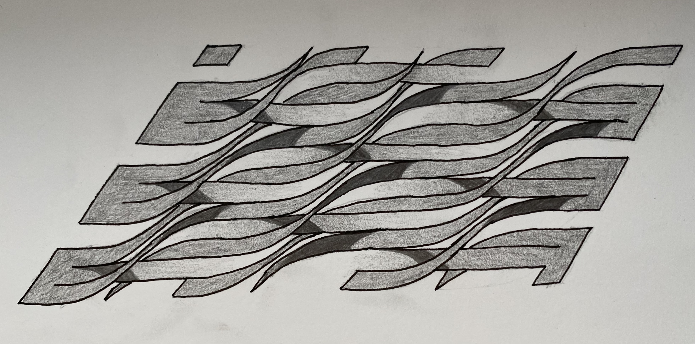

<!--  -->

I'm a software engineer who builds AI applications. For work inquiries visit my consulting agency [Harmonic Software](https://harmonic.so).

##### Contact
- Email: <a href="mailto:daniel@harmonic.so">daniel@harmonic.so</a>
- Twitter: <a href="https://twitter.com/dnsosebee" target="_blank">@dnsosebee</a>
- Github: <a href="https://github.com/dnsosebee" target="_blank">@dnsosebee</a>
- LinkedIn: <a href="https://www.linkedin.com/in/danielsosebee/" target="_blank">Daniel Sosebee</a>
- <a href="https://www.admonymous.co/dnsosebee" target="_blank">Leave me anonymous feedback</a>

## Pages by Interest
### Programming & logic

- [🪴 Human Programming Writings and Definitions](/human-programming) - I develop tools for specifying and executing "human programs" - formally-defined human workflows or multi-agent workflows.
  <!-- - 2022-09: [Meet Methodable pt. 3: Meet the Block Types](https://humanprogramming.substack.com/p/meet-methodable-pt-3-meet-the-block)
  - 2022-07: [Why to Store Descriptions of Workflows and Not Just Guides](https://humanprogramming.substack.com/p/why-to-store-descriptions-of-workflows)
  - 2022-06: [⭐ The 'Meet Methodable' program](https://a.methodable.com/guide/e0412eb2-36fd-4903-b186-d2de931fefc7)
  - 2022-02: [The Untapped Potential of Human Programming](https://humanprogramming.substack.com/p/the-untapped-potential-of-human-programming) -->
- [🪴 Daniel's Approved Riddles](/riddles) - A collection of top tier math and logic riddles.

### Music & art

- [🪴 Music Gallery](/music) - my piano and electronic music recordings.
- [🪴 Visual Art Gallery](/art) - my drawings and paintings.

### Other

- [🪴 What I'm Up To Now](/now)
- [🪴 My Bookshelf](/bookshelf)
- [🪴 Sneaky Town](/sneaky-town) - a board game I'm designing.

## Journal Entries

- 2024-07: [Every-Year Carry 2024](/eyc-2024)
- 2024-03: [The Origins of LIFE](/origins-of-life)

## How this site was made

Here is [this site's source code](https://github.com/dnsosebee/garden). All content is written in [markdown](https://www.markdownguide.org/) (including the [visual art gallery](/art)!) and published as static HTML pages using [Astro](https://astro.build/). The sidebar and site styles are thanks to the [Starlight documentation theme](https://starlight.astro.build/).
